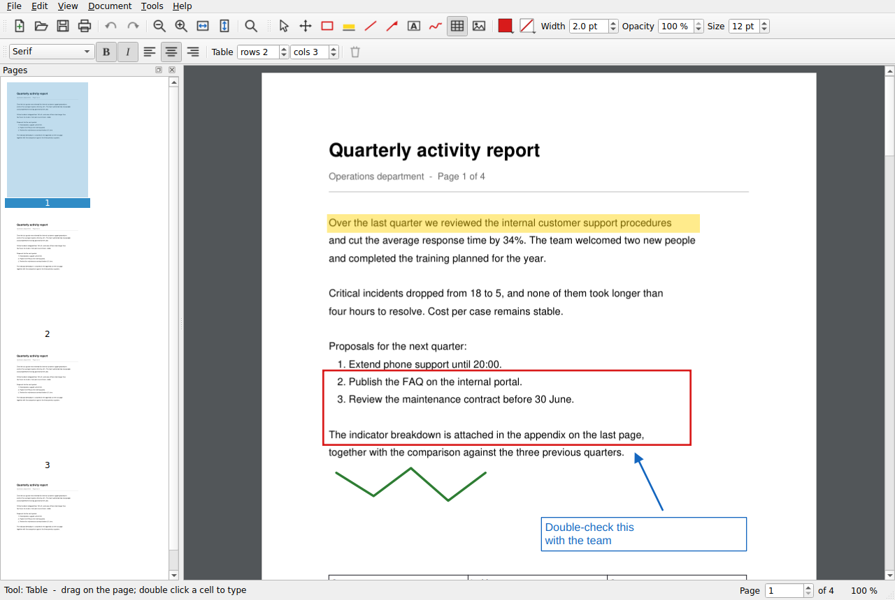

<p align="center">
  
</p>

<h1 align="center">easypdf.surf</h1>

<p align="center">
  <b>Lector de PDF sencillo con anotaciones e impresion.</b><br>
  Abre, lee, imprime y dibuja cuadros, lineas, flechas y texto encima de tus PDF.<br>
  Como Adobe Reader, pero mucho mas simple, libre y gratuito.
</p>

<p align="center">
  <b><a href="https://easypdf.surf">easypdf.surf</a></b>
</p>

<p align="center">
  <a href="LICENSE"></a>
  
  
</p>

---

## Descargar (un solo clic)

La forma mas comoda es la pagina web del proyecto:
**[easypdf.surf](https://easypdf.surf)**.
Tambien puedes descargar desde aqui mismo:

### Windows 10 u 11

<p align="center">
  <a href="https://github.com/mefardales/easypdf/releases/download/v1.0.0/EasyPDF-1.0.0-Setup.exe">
    
  </a>
</p>

1. Pulsa el boton de arriba: se descarga `EasyPDF-1.0.0-Setup.exe`.
2. Doble clic en el archivo descargado (suele quedar en la carpeta *Descargas*).
3. Si Windows muestra un aviso azul de *Windows protegio tu PC*, pulsa
   **Mas informacion** y despues **Ejecutar de todas formas**. Sale porque el
   programa no esta firmado con un certificado de pago, no porque tenga nada raro.
4. Siguiente, siguiente y listo. easypdf.surf queda en el menu Inicio.

No necesitas ser administrador ni instalar Python ni nada mas.

<details>
<summary>Otras descargas (portable y Linux)</summary>

<br>

| Descarga | Para que sirve |
|---|---|
| [**EasyPDF portable para Windows (.zip)**](https://github.com/mefardales/easypdf/releases/download/v1.0.0/EasyPDF-1.0.0-windows-x64-portable.zip) | No instala nada. Descomprime la carpeta y abre `EasyPDF.exe`. Funciona desde un pendrive. |
| [**EasyPDF para Linux (.tar.xz)**](https://github.com/mefardales/easypdf/releases/download/v1.0.0/EasyPDF-1.0.0-linux-x64.tar.xz) | Descomprime y ejecuta `./EasyPDF`. No necesita instalacion. |

Tambien estan todos en la carpeta [`build/`](build/) y en la
[pagina de releases](https://github.com/mefardales/easypdf/releases), con sus
`sha256` para comprobar la descarga.

</details>

## Que hace

| | |
|---|---|
| **Leer** | Desplazamiento continuo, miniaturas de paginas, zoom, ajustar al ancho o a la pagina, busqueda de texto (`Ctrl+F`), documentos protegidos con contrasena. |
| **Crear** | Documentos en blanco (`Ctrl+N`), anadir, duplicar, mover y eliminar paginas, en A4, Carta, A5, A3 u Oficio, en vertical u horizontal. |
| **Anotar** | Cuadros, resaltado, lineas, flechas, cuadros de texto, dibujo a mano alzada, **tablas** con celdas editables e **imagenes** (arrastralas sobre la ventana). Tipo de letra sans, serif o monoespaciada, negrita, cursiva y alineacion. Se mueven, se redimensionan, se cambian de color y se borran. Deshacer y rehacer ilimitados. |
| **Reutilizar** | Guarda membretes, tablas o sellos como **plantillas** y crealos de nuevo en otro documento con un clic. |
| **Imprimir** | Dialogo de impresion del sistema, vista previa, rango de paginas. Lo que se imprime incluye las anotaciones. |
| **Guardar** | Las anotaciones se escriben como **anotaciones PDF estandar**: se ven igual en Adobe Reader, Edge o Firefox, y el contenido original del documento no se toca. |

Todo con una interfaz en espanol, sin cuentas, sin publicidad y sin conexion a internet.

## Capturas

<p align="center">
  
</p>

## Guia rapida

| Accion | Atajo |
|---|---|
| Abrir / Guardar / Guardar como | `Ctrl+O` / `Ctrl+S` / `Ctrl+Shift+S` |
| Imprimir / Vista previa | `Ctrl+P` / `Ctrl+Shift+P` |
| Buscar / Siguiente / Anterior | `Ctrl+F` / `F3` / `Shift+F3` |
| Deshacer / Rehacer | `Ctrl+Z` / `Ctrl+Y` |
| Zoom | `Ctrl+rueda`, `Ctrl++`, `Ctrl+-`, `Ctrl+0` |
| Ajustar al ancho / a la pagina | `Ctrl+1` / `Ctrl+2` |
| Ir a la pagina | `Ctrl+G` |
| Nuevo documento / Anadir pagina | `Ctrl+N` / `Ctrl+Shift+N` |
| Herramientas | `S` seleccionar, `H` mover, `R` cuadro, `M` resaltar, `L` linea, `F` flecha, `T` texto, `D` dibujo, `A` tabla, `I` imagen |
| Negrita / Cursiva | `Ctrl+B` / `Ctrl+I` |
| Cancelar / volver a seleccionar | `Esc` |
| Borrar lo seleccionado | `Supr` |

Detalles utiles:

- Arrastra un PDF sobre la ventana para abrirlo.
- Manten **Mayus** mientras dibujas para cuadrados perfectos o lineas a 45 grados.
- Doble clic en un cuadro de texto para escribir dentro; `Esc` para terminar.
- Los tiradores azules de una anotacion seleccionada permiten redimensionarla.
- El color, el grosor y la opacidad de la barra de herramientas se aplican tanto a
  la siguiente anotacion como a la que tengas seleccionada.

## Ejecutar desde el codigo fuente

Funciona igual en Windows, Linux y macOS.

```bash
git clone https://github.com/mefardales/easypdf.git
cd easypdf

python -m venv .venv
# Windows:        .venv\Scripts\activate
# Linux / macOS:  source .venv/bin/activate

pip install -r requirements.txt
python -m easypdf                 # o:  python -m easypdf documento.pdf
```

En Linux, Qt necesita algunas bibliotecas del sistema:

```bash
sudo apt install libegl1 libgl1 libxkbcommon-x11-0 libxcb-cursor0 libdbus-1-3
```

## Compilar el .exe y el instalador

### Windows: todo de una vez

Con [Inno Setup 6](https://jrsoftware.org/isdl.php) instalado (opcional):

```powershell
powershell -ExecutionPolicy Bypass -File packaging\build_windows.ps1
```

El script crea el entorno virtual, instala dependencias, regenera el icono, pasa las
pruebas y deja el resultado en:

```
dist\EasyPDF\EasyPDF.exe                              <- carpeta ejecutable
build\EasyPDF-1.0.0-Setup.exe                         <- instalador
build\EasyPDF-1.0.0-windows-x64-portable.zip          <- portable
```

### Windows: paso a paso

```powershell
pip install -r requirements-dev.txt
python tools\make_icon.py                     # genera assets\easypdf.ico
pyinstaller packaging\easypdf.spec --noconfirm --clean --workpath .pyinstaller
& "${env:ProgramFiles(x86)}\Inno Setup 6\ISCC.exe" packaging\installer.iss
```

### Linux

```bash
bash packaging/build_linux.sh                 # -> build/EasyPDF-1.0.0-linux-x64.tar.xz
```

> Los ejecutables de Windows solo se generan desde Windows: PyInstaller no compila
> para una plataforma distinta de aquella en la que corre.

### Compilacion automatica

Los flujos `.github/workflows/build-windows.yml` y `build-linux.yml` compilan en
runners de Windows y de Linux. Se pueden lanzar a mano desde la pestana *Actions*
(guardan el resultado en `build/`) y ademas se disparan con cada etiqueta. Para
publicar una version:

```bash
git tag v1.0.0
git push origin v1.0.0
```

GitHub Actions ejecuta las pruebas, empaqueta y adjunta los tres archivos a la
release.

> Para cambiar el numero de version, actualizalo en `src/easypdf/__init__.py`,
> `pyproject.toml`, `packaging/installer.iss` y `packaging/version_info.txt`.

### Cambiar el icono

El icono actual esta dibujado por codigo en `src/easypdf/ui/icons.py`. Si prefieres
usar tu propia imagen, deja un PNG cuadrado (512x512 con fondo transparente va
perfecto) en `assets/easypdf-original.png` y ejecuta:

```bash
python tools/make_icon.py
```

Se regeneran `assets/easypdf.ico` y `assets/easypdf.png` con todos los tamanos, y
esa imagen la usan por igual la ventana, el ejecutable y el instalador.

## Como se guardan las anotaciones

easypdf.surf **nunca modifica el contenido original** del PDF. Guarda siempre los bytes
del archivo tal y como se abrio y, al guardar, les anade las anotaciones actuales:

| Herramienta | Anotacion PDF que se escribe |
|---|---|
| Cuadro | `Square` |
| Resaltado | `Highlight` |
| Linea y flecha | `Line` (la flecha con punta cerrada) |
| Texto | `FreeText` (Helvetica, Times o Courier; negrita y cursiva en texto enriquecido) |
| Tabla | `Ink` con la rejilla + un `FreeText` por celda con texto |
| Imagen | se incrusta en el contenido de la pagina (no es una anotacion, asi se imprime siempre) |
| Dibujo libre | `Ink` |

Como se parte siempre del archivo original, guardar dos veces no duplica nada y las
anotaciones siguen siendo editables durante toda la sesion. Al volver a abrir el
archivo guardado, las anotaciones se ven (las dibuja el propio PDF) pero pasan a
formar parte del documento.

Las coordenadas se guardan en puntos PDF con el origen arriba a la izquierda, y se
corrige la rotacion de la pagina, asi que lo que dibujas es exactamente lo que sale
impreso, incluso en paginas giradas.

## Estructura del proyecto

```
src/easypdf/
  model.py          Modelo de anotaciones (Python puro, sin Qt ni PDF)
  templates.py      Plantillas reutilizables (JSON)
  document.py       Apertura, render, busqueda y guardado (PyMuPDF)
  annotations.py    Modelo -> anotaciones PDF reales
  printing.py       Impresion y vista previa
  config.py         Preferencias (QSettings)
  app.py            Arranque de la aplicacion
  ui/
    main_window.py  Menus, barras, miniaturas, busqueda
    page_view.py    Visor, herramientas, zoom y navegacion
    items.py        Anotaciones dibujadas en pantalla
    commands.py     Deshacer / rehacer
    icons.py        Iconos dibujados por codigo
packaging/          PyInstaller + Inno Setup + guiones de compilacion
build/              Ejecutables publicados (Windows y Linux)
site/               Pagina web (ingles en /, espanol en /es/; tools/build_site.py)
render.yaml         Despliegue de la web en Render
tools/make_icon.py  Genera assets/easypdf.ico
tests/              93 pruebas (modelo, PDF, plantillas, interfaz e impresion)
```

## Desarrollo

```bash
pip install -r requirements-dev.txt
pytest -q          # pruebas (la interfaz se prueba en modo offscreen)
ruff check src tests tools
```

Para tocar la web: `python tools/build_site.py` regenera las dos paginas, el
`robots.txt` y el `sitemap.xml`. Como se publica esta en
[docs/DESPLIEGUE-WEB.md](docs/DESPLIEGUE-WEB.md).

Las contribuciones son bienvenidas: lee [CONTRIBUTING.md](CONTRIBUTING.md).

## Hoja de ruta

- [ ] Girar paginas y guardar el giro
- [ ] Seleccionar y copiar texto del documento
- [ ] Resaltado ajustado a las lineas de texto seleccionadas
- [x] Sellos y firma con imagen
- [ ] Unir varios PDF en uno
- [ ] Interfaz en ingles

## Licencia

easypdf.surf es software libre bajo la **[GNU AGPL v3 o posterior](LICENSE)**.

Usa [PyMuPDF](https://pymupdf.readthedocs.io/) (AGPL-3.0) para leer y escribir PDF y
[PySide6](https://doc.qt.io/qtforpython/) (LGPL-3.0) para la interfaz. Al enlazar con
PyMuPDF, cualquier version distribuida debe publicarse tambien bajo AGPL
con su codigo fuente disponible.
